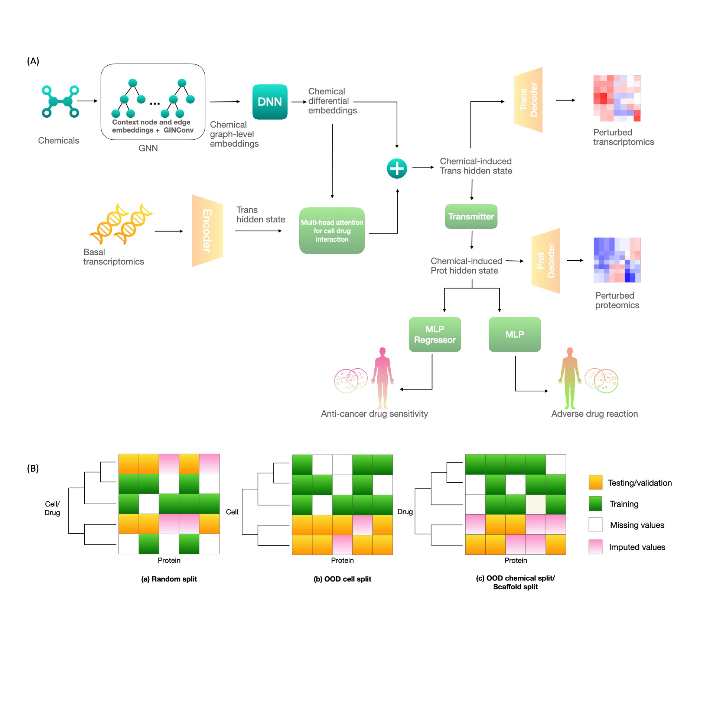

# TransPro : Hierarchical Multi-omics Data Integration and Modeling to Predict Novel Chemical-Induced Cell-Specific Proteomics Profiles for Systems Pharmacology

TransPro is an end-to-end multi-task deep learning framework for predicting cell-specific proteomics profiles as well as cellular and organismal phenotypes perturbed by novel unseen chemicals from abundant transcriptomics data, and hierarchically integrating multi-omics data
following the central dogma of molecular biology. Our comprehensive evaluations
of anti-cancer drug sensitivity and drug adverse reaction predictions suggest that
the accuracy of TransPro predictions is comparable to that of experimental data.
Thus, TransPro could be a useful tool for proteomics data imputation and systems
pharmacology-oriented compound screening.

<a rel="license" href="http://creativecommons.org/licenses/by/4.0/"></a><br />This work is licensed under a <a rel="license" href="http://creativecommons.org/licenses/by/4.0/">Creative Commons Attribution 4.0 International License</a>.
# Architecture


# Data Download

data can be downloaded via 
[](https://doi.org/10.5281/zenodo.7699298)

# **Getting Started**

These instructions will get you a copy of the project up and running on your local machine for development and testing purposes.

## **Prerequisites**

To run this project, you will need to have the following installed on your local machine:

- Python 3.9 or higher
- Pytorch 1.10 or higher (with CUDA)
- Pytorch geometric
- Rdkit

## **Installing**

1. Clone this repository onto your local machine using the following command:
    
    ```
    git clone https://github.com/AdorableYoyo/TransPro_a.git
    ```
    
2. Create a new Conda environment with Python 3.9 by running the following command:
    
    ```
    conda create -n TransPro python=3.9
    ```
    
3. Activate the new Conda environment by running the following command:
    
    ```
    conda activate TransPro
    ```
    
4. Install the required Python packages in the Conda environment using the following command:
    
    ```
    bash scripts/conda_env.sh 
    ```
    

# Usage - how to run the code for different tasks, reproduce the results

## **1. Model Training with Perturbed Proteomics Prediction**

The objective of this task is to train a TransPro model using perturbed proteomics data ( optionally with perturbed transcriptomics data as well)  and evaluate it under three different scenarios. 

To start training and evaluating, run 

```
scripts/transPro_train.sh
```

The three different scenarios that will be evaluated are:

1. Out-of-distribution (OOD) novel chemical (split=stadScaf)
2. OOD novel cell (split=cell_split)
3. In-distribution (ID) (split=rand_split)

The script will output a log file for each scenario, which will be saved in the "2023_logs" directory.( create one in your local repo)

To run the script for each scenario, set the corresponding "split" variable in the script and run the script. For example, to train and evaluate the model for the OOD novel chemical scenario, set the "split=stadScaf". Similarly, to train and evaluate the model for the OOD novel cell scenario, set "split=cell_split"…

Note that the script will train and evaluate the model for each scenario with different random seeds, which will be specified by the "seed" variable in the script. This is done for reproducibility purposes.

## **2. Model Inference**

1. to get embeddings (for the downstream task eg. adverse drug reaction prediction ),
    
    run script 
    
    ```
     scripts/transPro_get_embeddings.sh 
    ```
    
    To get embeddings for different adverse drug reaction dataset, set “dataset” to “FAERS/SIDERS” with “conf_level” to “0.3/0.5”.
    
    The script will output a log file in the same path set before, and a predicted result file in the path past to —predicted_result_for_testset. One may create a folder “predictions” in the root path.
    
2. to get final prediction using the pre-trained model ,run script : 
    
    ```
    scripts/transPro_get_final_predictions.sh 
    ```
    
    one can pass other files to —pert_pros_test_dir to get the predictions, as long as the cells and drugs are in the research scope.
    
    The default file in the bash file is an example of MCF7 cell interacting with the single target drugs. Please refer to this format when passing different test files.
    
    The script will output a log file in the same path set before, and a predicted result file in the path past to —predicted_result_for_testset. One may create a folder “predictions” in the root path.
    

## 3. Adverse Drug Reaction Prediction

This task involves training another deepNN models for ADR prediction using different input data types, namely experimental transcriptomics, experimental proteomics, and TransPro output proteomics.

Run script

```
scripts/adr_prediction.sh
```

One may change the path according to different input data:

a) Experimental transcriptomics data with the path specified as:

 —-gx_file "data/Side_effect/${cur_dataset}*PTs_allCells*${conf_level}conf_CellLineDGX.csv"

b) Experimental proteomics data with the path specified as: 

—-gx_file "data/Side_effect/Prot_${cur_dataset}_experimental.csv"

**`--exp_pros`** set to 1.

c) TransPro output perturbed proteomics data with the path specified as: 

—-gx_file "data/side_effect/0423Pros_preds_512ab_${cur_dataset}*PTs_allCells*${conf_level}conf_3.33um_w_pertTrans.csv

The script will output a log file in the same path set before. 

## 4. Anti-cancer drug sensitivity prediction

An end-to-end training pipeline was built on top of TransPro architecture for the transcriptomics
and proteomics predictions by using the drug sensitivity information (IC50) to fine-tune
the pre-trained TransPro model. 

Run script:

```
scripts/Ic_50_task.sh
```

Change “job” to  “perturbed_trans” or “perturbed_pros”  accordingly for using either the transcriptomics embedding or the proteomics embedding for evaluating the predictive power of the predicted transcriptomics profiles or of the predictive proteomics profiles, respectively.

The script will output a log file in the same path set before.

## **Authors**

- **You Wu, Qiao Liu, Lei Xie**
